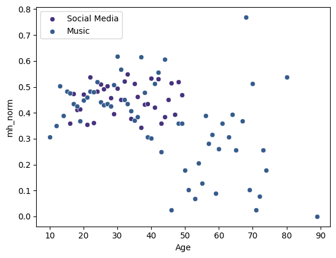

# 📊 Cross-Dataset Comparison

After exploring each dataset independently, this section shows how the three lifestyle behaviors compare in their association with mental health.

---

## 👥 Mental Health by Age Across All Datasets

This plot compares the **mean mental health score by age** for Music, Gym, and Social Media.

---

## 📊 Average Mental Health Score per Dataset

---

## 🎶 Favorite Genre vs Mental Health (Colored by Music Effects)

---

### 🔎 Overall Synthesis

- Music appears to have the smallest negative impact and may act as emotional regulation.  
- Gym data shows the strongest positive correlation with mental health.  
- High screen time in social media users is consistently tied to lower MH scores.  
- Age differences show distinct behavioral clusters across datasets.  
