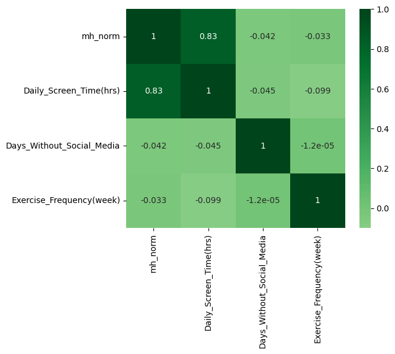

# Social Media Dataset

This dataset explores the relationship between mental health and **screen time**, **platform preference**, and **sleep quality**.

---

## Correlation Heatmap

---

## Daily Screen Time vs Mental Health

---

## Platform vs Mental Health (Boxplot)

---

## Sleep Quality vs Screen Time

---

### Key Insights

- Higher screen time is associated with lower mental health scores.  
- Platforms differ in average MH impact.  
- Poorer sleep quality tends to be linked with high daily screen time.  
